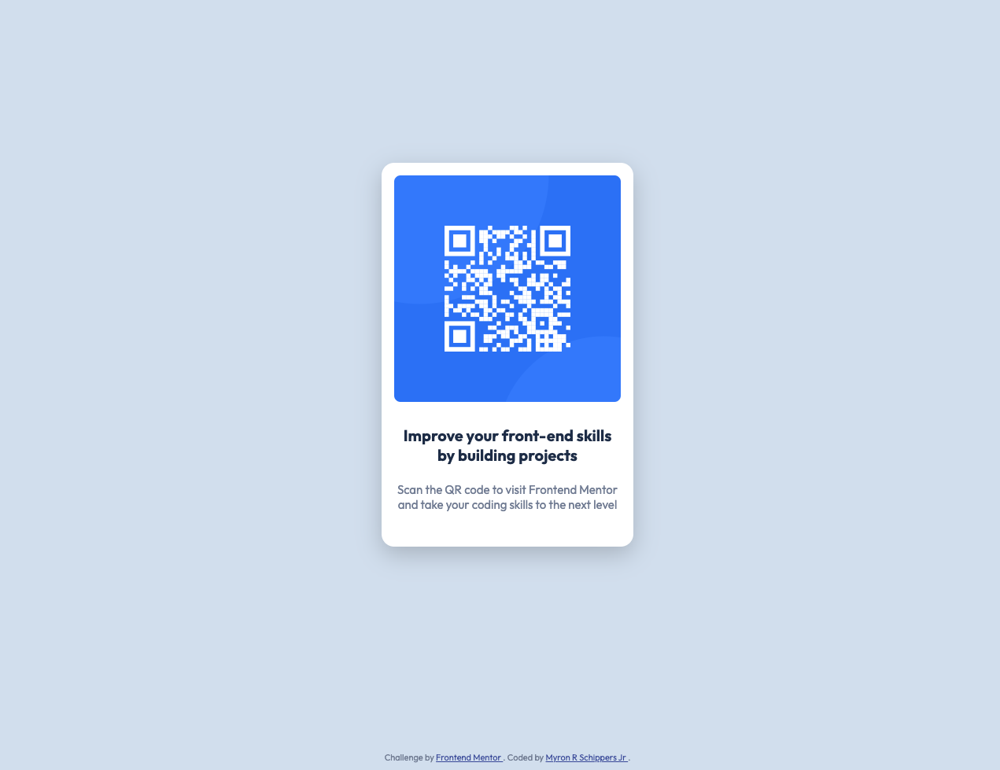
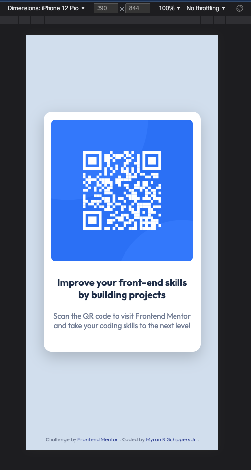
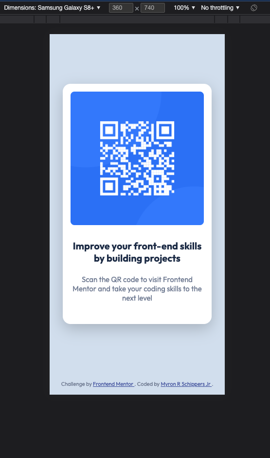

# Frontend Mentor - QR code component solution


This is a solution to the [QR code component challenge on Frontend Mentor](https://www.frontendmentor.io/challenges/qr-code-component-iux_sIO_H). Frontend Mentor challenges help you improve your coding skills by building realistic projects. It is a very basic HTML/CSS component.

## Table of contents

- [Overview](#overview)
  - [Screenshot](#screenshot)
  - [Links](#links)
- [My process](#my-process)
  - [Built with](#built-with)
  - [What I learned](#what-i-learned)
  - [Continued development](#continued-development)
  - [Useful resources](#useful-resources)
- [Author](#author)
- [Acknowledgments](#acknowledgments)

## Overview

### Screenshot

**Desktop:**


**Mobile iPhone 12:**


**Mobile Samsung Galaxy S8+:**


### Links

- Solution URL: [GitHub Repo](https://github.com/myronschippers/qr-code-component)

## My process

### Built with

- Semantic HTML5 markup
- CSS custom properties
- Flexbox
- Mobile-first workflow

### What I learned

Most of this was straight forward although a little guess work when it came to the `font-size`, `line-height`, and `letter-spacing` without access to the creative files.

- I did use a trick to measure padding, width, and other such parts of the design.
  - open the design images in the browser (chrome)
  - right click and select "inspect" for the `<body>`
  - click the `+` in the top right of the inspector tool and a new style block of `body {}` will be created for you
  - change the selector in the new style block to `body:after` then add the following base code
    ```css
    body:after {
      content: "";
      width: 100px;
      height: 100px;
      background: rgba(0,0,0,0.4);
      position: absolute;
      right: 100px;
      top: 100px;
    }
    ```
  - after base styles are in...
    - adjust `right` and `top` CSS properties to reposition the translucent box
    - adjust `width` and/or `height` CCS properties to measure the desired area

### Continued development

A great initial warmup but I will probably upgrade this...

- [ ] animate QR Code card onto the screen when the browser is first loaded
- [ ] add some click behavior to navigate a user to the challenge page on Frontend Mentor
- [ ] add accessibility for screen readers

### Useful resources

- [Flexbox](https://css-tricks.com/snippets/css/a-guide-to-flexbox/) - Awesome reference for flexbox properties

## Author

- LinkedIn - [Myron R Schippers Jr](https://www.linkedin.com/in/myron-schippers-jr/)
- Frontend Mentor - [@myronschippers](https://www.frontendmentor.io/profile/myronschippers)
- GitHub - [myronschippers](https://github.com/myronschippers)

## Acknowledgments

- Two thumbs way up for [CSS Tricks](https://css-tricks.com/) and their reference guides
